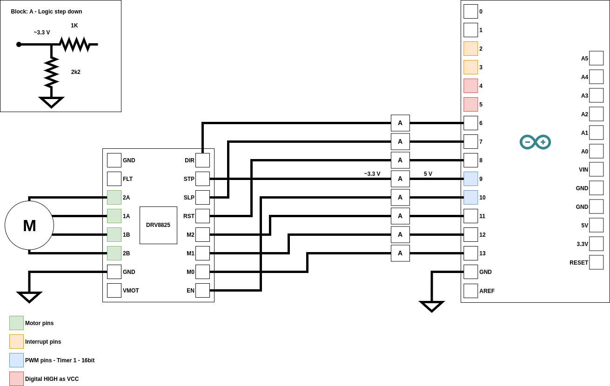
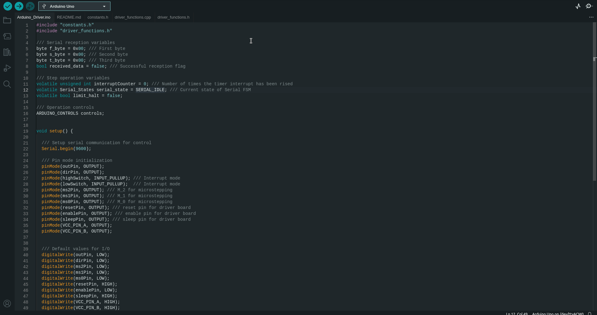

# Serial Motor Controller - Driver (SMCD): 

  

## Index 

## How does the driver works? 

## Hardware setup

In the following sections the recommended connection between the Arduino UNO and Pololu stepper driver board are showed and the steps to burn the driver

### 1. How to connect the Arduino board and Pololu controller board

  

The setup uses the digital pins 2-13 of the Arduino board. Pins 6-13 are used to interface directly with the Pololu driver board and are passed through a voltage divider (1k/2k2) that takes the 5V logical HIGH provided by the arduino to the 3.3V logic level used by the stepper driver. **Note that this step is not necessary as the official Pololu docummentation states that logic level of 5.25V are accepted.**

The pinout is detailed next: 

| **Arduino UNO digital pin** | **Description** | **Pololu board** |
|-----------------------------|-----------------|------------------|
| 0 | **UNUSED.** This pin is reserved for UART communication. | - |
| 1 | **UNUSED.** This pin is reserved for UART communication. | - |
| 2 | Available for use with limit switch. Can be used to limit the movement of the stepper motor automatically. If the voltage on the pin is LOW (0V) the controller assumes that the motor has reached a limit and stops operation. A nominal value of HIGH (5V) is needed for normal operation of the controller. **Reserved for limit switches because they allow hardware interrupts on the arduino.**| - |
| 3 | Available for use with limit switch. Can be used to limit the movement of the stepper motor automatically. If the voltage on the pin is LOW (0V) the controller assumes that the motor has reached a limit and stops operation. A nominal value of HIGH (5V) is needed for normal operation of the controller. **Reserved for limit switches because they allow hardware interrupts on the arduino.** | - |
| 4 | Used as VCC (5V) source of limit switch. | - |
| 5 | Used as VCC (5V) source of limit switch. | - |
| 6 | Controls the direction of the motor. Logic HIGH (5V) clockwise operation. Logic LOW (0V) counterclockwise operation. | DIR |
| 7 | Controls the sleep-mode operation of the Pololu board. When HIGH (5V) the board is awake, holding torque is applied to the stepper-motor. When LOW (0V) the board is slept and holding torque is disabled. If the Pololu board is on sleep-mode, when sending step-commands, the Arduino wakes the board before each step is taken and then is put back to sleep when step operation is done. | STP |
| 8 | When LOW (0V) resets the Pololu board. | RST | 
| 9 | Step signal for the Pololu board. **Reserved to use as the output of Timer1.** | STP | 
| 10 | Enables the Pololu board. Logic LOW (0V) for enable. | EN | 
| 11 | Microstepping selection | M2 |
| 12 | Microstepping selection | M1 |
| 13 | Microstepping selection | M0 |
| GND | Ground must be shared between the Arduino and the Pololu board. | GND | 

All Analog pins are available for use. 

### 2. Programing the arduino

To load the driver onto the Arduino board, you can use the [Arduino-IDE](https://www.arduino.cc/en/software), just use the `Arduino_Driver.ino` as the main, verify and burn!

  

You can check if the burning was sucessful by performing a `connect test` through the [GUI](https://github.com/Wauro21/Stepper-Motor-Controller):

  

**It takes about 5-10 seconds to perform the test, as the Arduino reboots itself when the serial port is openned.**
