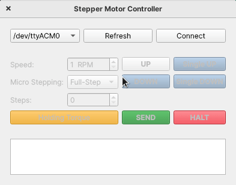

# Serial Motor Controller - Driver (SMCD): 

  

**The `SMCD (Serial Motor Controller Driver)` allows to control a stepper-motor using an Arduino UNO in conjunction with the Pololu DVR8825 driver board. The driver is intended to be used with the SMC-GUI or API.**

This is part of the [SMC project](https://github.com/Wauro21/SMC)! Check the main project or the python-based API [SMCC](https://github.com/Wauro21/SMCC).

## Index 

- [Serial Motor Controller - Driver (SMCD):](#serial-motor-controller---driver-smcd)
  - [Index](#index)
  - [How does the driver works?](#how-does-the-driver-works)
  - [Hardware setup](#hardware-setup)
    - [1. How to connect the Arduino board and Pololu controller board](#1-how-to-connect-the-arduino-board-and-pololu-controller-board)
    - [2. Programing the arduino](#2-programing-the-arduino)
  - [What commands/functionalities are implemented?](#what-commandsfunctionalities-are-implemented)

## How does the driver works? 

The basic idea, is that the Arduino only generates a square wave signal that has an specific frequency associated with the desired motor characteristics, speed and micro-stepping settings. The frequency is defined by the DVR8825 controller according to this expression:

$$
f_{step} = \frac{v (rotation/minute) \times 360 (°/rotation) \times n_{m} (\mu steps/step)}{60 (seconds/minute) \times \theta (°/step)}
$$

So if we want to rotate a stepper motor of 3.75°/step at 10 rpm, using micro-stepping 1/8, the frequency can be calculated as follows:

$$
f_{step} = \frac{10 rpm \times 360 (°/rotation) \times 8 (\mu steps/step)}{60 (seconds/minute) \times 3.75 (°/step)} = 128 Hz
$$

**For more information about the frequency requierements of the Pololu DVR8825 is recommended to check the controller's datasheet: [DVR8825 Stepper Controller IC](https://www.ti.com/lit/ds/symlink/drv8825.pdf?ts=1690090694862&ref_url=https%253A%252F%252Fwww.google.com%252F).**

The main task of the Arduino is to generate this square wave signal with the desired frequency and to count the number of pulses to match them with the desired steps to take. For this the Arduino's Timer1 is used on CTC mode. The following figure is taken from the [ATMEL ATmega328P datashet](https://ww1.microchip.com/downloads/en/DeviceDoc/Atmel-7810-Automotive-Microcontrollers-ATmega328P_Datasheet.pdf) from the Timer1 configuration: 

  

In the CTC mode the timer, uses the main clock, prescaled to a defined value in this case we use a prescaler of 64 (N=64), to count to a maximum defined by the OCR1A register. Each times this maximum is reached a interrupt is set. 

The OCR1A is used to generate the square wave signal frequency found for the desired motor characteristics, speed and micro-stepping mode according to the following expression:

$$
f_{OCnA} = \frac{f_{clk}}{2 \times N \times (1 + OCRnA)}
$$

Where $f_{OCnA}$ is the target frequency. $N$ is the prescaler. $f_{clk}$ is the Arduino's UNO default frequency of 16 MHz. $OCRnA$ is the value to count to generated $f_{OCnA}, solving for this value:

$$
OCRnA = \frac{f_{clk}}{2 \times N \times f_{OCnA}} - 1
$$

Yields the requiered register value to generate the target frequency needed for the motor characteristics, speed and micro-stepping configurations. 

To control how many steps the motor takes using the generated square wave, the OCnA interrupt is used. Considered the case that the controller wants to take 96 steps. This means that the output square signal has to send 96 pulses to the DVR8825 controller board. This means the interrupt flag must have been set $2 \times 96$ times, so this idea can be used to control how many steps have been taken by the controller.

This is the core idea behind the `SMC-Driver`.

## Hardware setup

In the following sections the recommended connection between the Arduino UNO and Pololu stepper driver board are showed and the steps to burn the driver

### 1. How to connect the Arduino board and Pololu controller board

  

The setup uses the digital pins 2-13 of the Arduino board. Pins 6-13 are used to interface directly with the Pololu driver board and are passed through a voltage divider (1k/2k2) that takes the 5V logical HIGH provided by the arduino to the 3.3V logic level used by the stepper driver. **Note that this step is not necessary as the official Pololu docummentation states that logic level of 5.25V are accepted.**

The pinout is detailed next: 

| **Arduino UNO digital pin** | **Description** | **Pololu board** |
|-----------------------------|-----------------|------------------|
| 0 | **UNUSED.** This pin is reserved for UART communication. | - |
| 1 | **UNUSED.** This pin is reserved for UART communication. | - |
| 2 | Available for use with limit switch. Can be used to limit the movement of the stepper motor automatically. If the voltage on the pin is LOW (0V) the controller assumes that the motor has reached a limit and stops operation. A nominal value of HIGH (5V) is needed for normal operation of the controller. **Reserved for limit switches because they allow hardware interrupts on the arduino.**| - |
| 3 | Available for use with limit switch. Can be used to limit the movement of the stepper motor automatically. If the voltage on the pin is LOW (0V) the controller assumes that the motor has reached a limit and stops operation. A nominal value of HIGH (5V) is needed for normal operation of the controller. **Reserved for limit switches because they allow hardware interrupts on the arduino.** | - |
| 4 | Used as VCC (5V) source of limit switch. | - |
| 5 | Used as VCC (5V) source of limit switch. | - |
| 6 | Controls the direction of the motor. Logic HIGH (5V) clockwise operation. Logic LOW (0V) counterclockwise operation. | DIR |
| 7 | Controls the sleep-mode operation of the Pololu board. When HIGH (5V) the board is awake, holding torque is applied to the stepper-motor. When LOW (0V) the board is slept and holding torque is disabled. If the Pololu board is on sleep-mode, when sending step-commands, the Arduino wakes the board before each step is taken and then is put back to sleep when step operation is done. | STP |
| 8 | When LOW (0V) resets the Pololu board. | RST | 
| 9 | Step signal for the Pololu board. **Reserved to use as the output of Timer1.** | STP | 
| 10 | Enables the Pololu board. Logic LOW (0V) for enable. | EN | 
| 11 | Microstepping selection | M2 |
| 12 | Microstepping selection | M1 |
| 13 | Microstepping selection | M0 |
| GND | Ground must be shared between the Arduino and the Pololu board. | GND | 

All Analog pins are available for use. 

### 2. Programing the arduino

To load the driver onto the Arduino board, you can use the [Arduino-IDE](https://www.arduino.cc/en/software), just use the `Arduino_Driver.ino` as the main, verify and burn!

  

You can check if the burning was sucessful by performing a `connect test` through the [GUI](https://github.com/Wauro21/Stepper-Motor-Controller):

  

**It takes about 5-10 seconds to perform the test, as the Arduino reboots itself when the serial port is openned.**

## What commands/functionalities are implemented? 

Programmed on the driver, there is a FSM that receives the commands sent via serial-port. The commands implemented on this FSM are the following:

  

The first byte always carry the CMD information. There are just four commands so two bits are used. The controller always reply to the commands with the actions taken, so in the case of SETUP, STEP and HALT the command sent and the reply should always match if everything is working alright.

- The **SETUP command** allows to setup the micro-stepping, reset, enable, sleep and the counter associated to the desired frequency as a 16-bit unsigned integer, this translates to the OCRnA register.

- The **STEP command** allows to setup the spin direction and the number of steps to be taken, as a 16 bit unsigned integer. 

- The **HALT command** is used to stop every motor operation being performed. 

-  The **INFO command** allows to receive the current state of the controller. The controller replis with the state of the micro-stepping, reset, enable and sleep pins in the first-byte of the response. Then sends two bytes that hold the frequency counter information, and finally two more bytes that hold the last step operation counter. 
